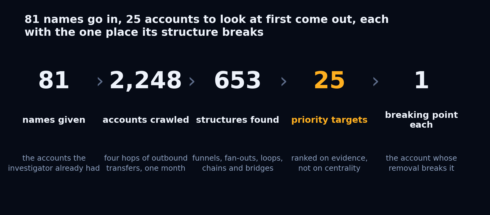
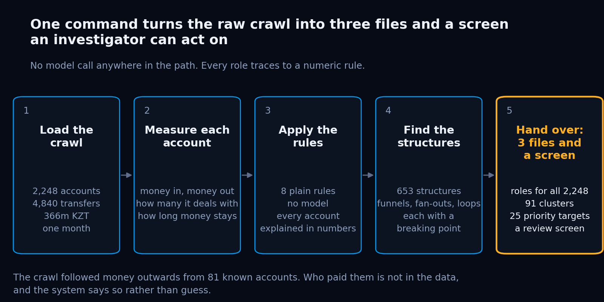
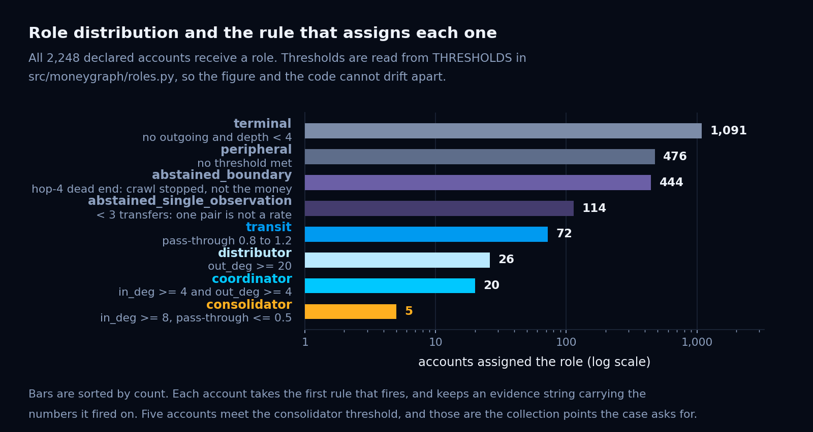
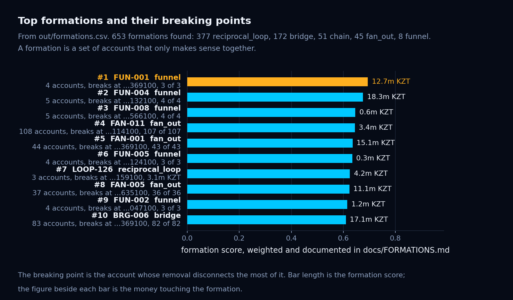
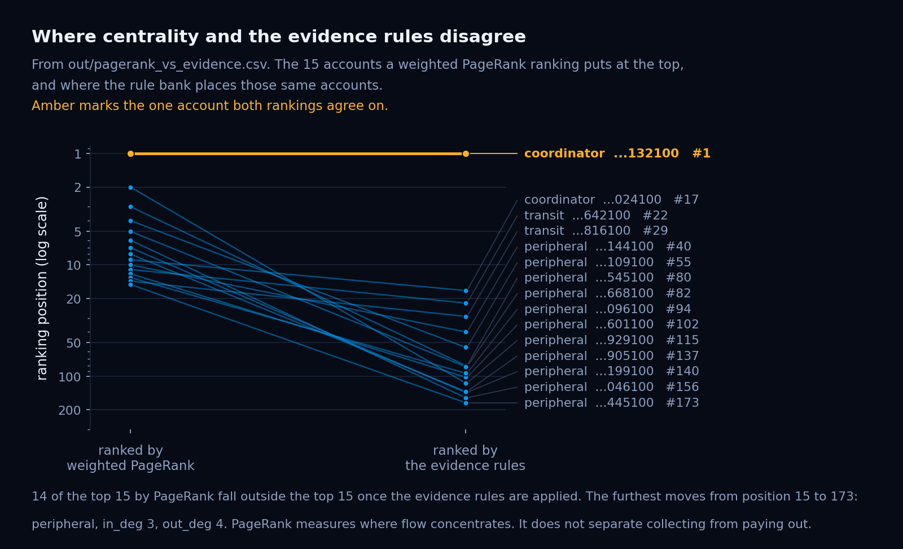
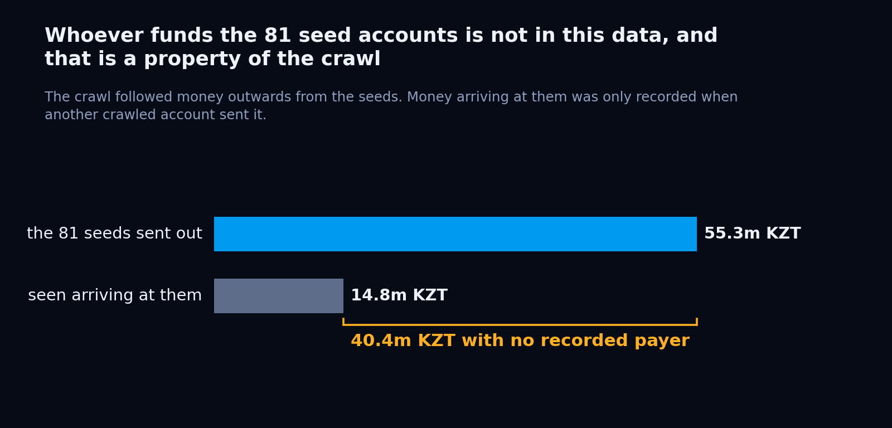
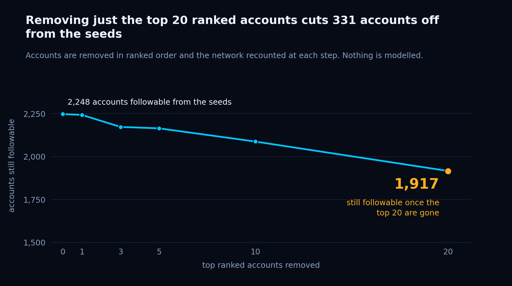

<div align="center">

# Money Graph

### An investigator is handed 81 accounts and 2,248 leads. This tells them where to act first, and what the data cannot show them.

**HackAlem AI 2026 · Track 02 · Freedom**

## [Open the live case file →](https://money-graph.pages.dev/web/)

**https://money-graph.pages.dev/web/** · nothing to install, the same screen `python3 run.py --serve` builds locally

</div>



*81 names given, 2,248 accounts crawled, 653 structures found, 25 priority targets, and one breaking point per structure.*

```
pip install -r requirements.txt
python3 run.py              # about a second, fifteen files in out/
python3 run.py --serve      # then open http://localhost:8000/web/
```

**Live:** https://money-graph.pages.dev (the same screen, served as a static site; `./deploy.sh` republishes it).

No API key. No network. No database. No build step. Five pinned dependencies.

---

## The problem, from the investigator's chair

A financial monitoring team flags 81 accounts. A crawl follows their outbound transfers four hops
out through July 2026 and comes back with 2,248 accounts, 3,119 transfer relationships and
365,890,012 KZT of movement. The team needs to know what that structure is, who holds it together,
and where to spend the next week.

A ranked list of suspicious accounts does not answer that. A rank is a name. Freeze one account in a
group of twelve and the other eleven carry on.

## What this hands over instead

**Structures, each with its breaking point.** The 2,248 accounts are grouped into 653 formations:
funnels, chains, loops, fan-outs and bridges. Every one names the single member whose removal breaks
it, and by how much. That is an instruction, not a score.

**A priority list that was tested, not asserted.** Remove the top 20 and 311 further accounts fall out
of reach of the money trail. That number comes from removing them and recounting.

**The honest edge of the map.** The crawl followed money outward, so whoever funds the 81 seeds was
never followed. 40,445,011 KZT arrived at the seeds from a payer nobody recorded. The system says so,
puts a number on it, and tells the team what to ask for next, ranked by what each request would buy.

**It declines to guess.** 558 accounts get no behavioural role because the crawl does not support one.
Each of those rows says why in its own evidence field.

---

## Compliance and functionality

Every mandatory requirement, where it is met, and how to check it.

| Requirement | Satisfied by | Verify |
|---|---|---|
| `nodes_roles.csv`, one row per node | `out/nodes_roles.csv`, asserted at `run.py` `assert len(nodes_roles) == report["nodes_declared"]` | `wc -l out/nodes_roles.csv` gives 2249 with header |
| Role from the taxonomy, extensions documented | `src/moneygraph/roles.py:37` `ROLES`; extension in `docs/COMPLETENESS.md` | `python3 -c "from src.moneygraph.roles import ROLES; print(ROLES)"` |
| Numeric evidence per node, under 200 characters | `roles.py:92` `_classify` returns evidence with the figures it fired on | `python3 -c "import pandas as pd; print(pd.read_csv('out/nodes_roles.csv').evidence.str.len().max())"` prints 161 |
| `clusters.csv` with a hypothesis per cluster | `out/clusters.csv`, 91 rows; `src/moneygraph/hypotheses.py` writes each sentence from that cluster's figures | asserted at `run.py` `cluster_table.hypothesis.str.len().gt(0).all()` |
| `top_nodes.csv`, at least 20 rows | `out/top_nodes.csv`, 25 rows; `src/moneygraph/priority.py:18` | asserted at `run.py` `assert len(top) >= 20` |
| Search any account by id | `web/index.html`, one search box in the top bar; returns the plain-language assessment, the rule and its numbers, money in and out, hop, group, priority, knowledge state, and the accounts around it on a map | `python3 run.py --serve`, type any gid |
| Roles are explainable, not a black box | `roles.py:44` `THRESHOLDS`, eight named rules, zero model calls in the repository | `grep -rn "openai\|anthropic\|import requests" src/` returns nothing |
| No hardcoded account lists | no gid literal in any `.py` or `.html` | `grep -rnE '1000000[0-9]{11}' src/ web/ tools/ run.py` returns nothing |
| No external enrichment, three parquet files in, fifteen files out | `src/moneygraph/dataio.py:27` `load` reads three files and nothing else | `grep -rln "urllib\|socket\|http" src/*/*.py` returns only `serve.py`, the local file server |
| Runs in under five minutes on a clean machine | About one second, measured from a fresh clone and virtual environment | `time python3 run.py` |
| Findings are hypotheses, never accusations | every generated string uses "the figures suggest", "worth checking as", "consistent with" | `grep -il "launder\|criminal\|fraud\|guilty" out/*` returns nothing |

The fifteen files in `out/` are committed. They regenerate byte for byte from `python3 run.py`, so a
judge can diff rather than trust.

---

## Technical implementation



*One command turns the raw crawl into three files and a screen. Load the crawl (2,248 accounts, 4,840 transfers, 366m KZT), measure each account, apply eight plain rules with no model call, find 653 structures each with a breaking point, hand over roles for all 2,248, 91 clusters, 25 priority targets and a review screen.*

### The rule bank



*69% of accounts are dead ends, and 444 of those are only dead ends because the crawl stopped. Terminal 1,091, peripheral 476, transit 72, distributor 26, coordinator 20, consolidator 5, and two abstention classes, 444 and 114, where the system declined to guess.*

Eight rules in one function, thresholds in one dict, each threshold placed against the observed
distribution and the reason written beside it in `src/moneygraph/roles.py:44`.

| Role | Count | Rule | Why the cutoff sits there |
|---|---:|---|---|
| `consolidator` | 5 | in-degree >= 8, pass-through <= 0.5 | The case declares a fan-in band of 8 to 24. Observed maximum is exactly 24 |
| `transit` | 72 | 0.8 <= pass-through <= 1.2 | Reproduces the 72 pass-through accounts the case declares, exactly |
| `distributor` | 26 | out-degree >= 20 | Falls in an empty bin. Observed values run 19, 19, 19, then 21, 21, 21 |
| `coordinator` | 20 | in-degree >= 4 and out-degree >= 4 | The weakest cutoff, and labelled as such in the code. A smooth decay, not a gap |
| `terminal` | 1,091 | money in, nothing out, not at the depth limit | The 444 truncated dead ends are excluded by construction |
| `peripheral` | 476 | below every threshold above | Includes the 19 accounts with no transfers at all, scored 0.1 |
| `abstained_boundary` | 444 | hop 4, no outgoing edge | Pass-through is zero because the crawl stopped, not because money stayed |
| `abstained_single_observation` | 114 | fewer than three transfers in total | A ratio from one pair of numbers is not a rate |

Precedence is widest fan-in, then widest fan-out, then relay ratio, then two-sided activity, because
an account can satisfy more than one rule and the earlier one is the stronger claim about it. That
order has a cost and the code says so: the transfer-count floor sits below transit, so **27 of the 72
transit accounts rest on a single transfer each way**. Moving the floor up would drop transit to 45 and
break the exact match with the case's declared 72. The rule stays and all 27 rows say in their own
evidence that the ratio is one observation rather than a rate.

The two abstention classes are held apart because the remedy differs: one more crawl hop resolves every
one of the 444 and none of the 114.

### Formations and breaking points



*Every structure has a breaking point, the one account whose removal disconnects the rest of it. The top formation is a funnel of 4 accounts carrying 12,684,846 KZT that breaks at account …369100.*

`src/moneygraph/formations.py:95` groups accounts into five kinds, each with a one-sentence rule:

| Kind | Found | Rule |
|---|---:|---|
| `funnel` | 8 | A collection point plus the payers sending it a dominant share of their outflow |
| `chain` | 51 | A directed path of relay accounts moving money onward with little retained |
| `reciprocal_loop` | 377 | A pair or short cycle returning funds to where they came from |
| `fan_out` | 45 | A distributor and the accounts it pays that have no outgoing transfer of their own |
| `bridge` | 172 | A small set whose removal splits an otherwise connected community |

The breaking point is computed by articulation point (`formations.py:394`), by dominator analysis from
the formation's entry (`formations.py:510`), or by flow where neither applies, and the method is
reported beside the number so 3 members is never confused with 3 tenge. Weights live in
`formations.py:54` and `:66`. `docs/FORMATIONS.md` recomputes the top formation by hand from the raw
parquet to its score of 0.6944, so a reviewer can check a row without running anything.

Fan-outs count their receivers in two groups, observed to the end and at the crawl boundary, because
92 of the 965 receiving accounts sit at hop 4 where nothing downstream was ever collected. Four
fan-outs have more boundary receivers than observed ones and say so in their own hypothesis.

### Why the ranking is not PageRank with extra steps



*14 of the 15 accounts a money-weighted PageRank would chase fall out of the top 15 once the rules are applied. The one both methods agree on is the coordinator ranked first.*

Of the 15 accounts a money-weighted PageRank puts at the top, 14 fall out of the top 15 once the rule
bank is applied, most to `peripheral` at positions 40 to 173. The single account both methods agree on
is the coordinator ranked first. The comparison is written to `out/pagerank_vs_evidence.csv` on every
run by `src/moneygraph/exhibits.py`.

### What the crawl could not see, as a computed output



*The 81 seed accounts sent out 55.3m KZT and only 14.8m KZT was seen arriving at them. The 40.4m KZT gap has no recorded payer, because the crawl never followed money inward.*

`src/moneygraph/completeness.py:94` assigns every account a knowledge state and a confidence score
from `CONFIDENCE_WEIGHTS` at line 44, and checks its own figures against the case's declared ground
truth at line 81.

| Knowledge state | Accounts | Share of money touched |
|---|---:|---:|
| `fully_observed` | 644 | 63.98% |
| `inbound_only` | 1,091 | 18.89% |
| `outbound_only` | 50 | 9.38% |
| `truncated_at_depth` | 444 | 7.74% |
| `isolated` | 19 | 0.00% |

1,604 accounts, 71.35% of the set, are not fully observed. The priority list reads two ways and both
are reported: only 2 of the top 20 rest directly on incomplete observation, but 15 of the top 20 send
money onward into the crawl boundary, with a mean 14.4% of everything beneath them sitting at hop 4 on
an unrecorded path. The uncertainty is not in the ranking. It is one hop underneath it.

### The pipeline

```
data/*.parquet
  dataio.py        three tables in, graph built from nodes.parquet not the edge list,
                   because 19 seeds appear in no edge and vanish otherwise (line 34)
  features.py      degrees, flows, PageRank, HITS with a fixed start vector (line 34),
                   pass-through, dwell, truncated_by_depth and genuine_terminal (lines 46 to 47)
  roles.py         the rule bank
  clusters.py      Louvain, seeded, plus weakly connected components
  hypotheses.py    one sentence per cluster from that cluster's own figures
  flows.py         reciprocal pairs, cycles, seed chains, the resilience curve
  formations.py    five kinds, breaking points, ranking
  completeness.py  knowledge state, confidence, the next data request
  priority.py      weighted ranking, WEIGHTS at line 11
  exhibits.py      where PageRank and the rules disagree
  timeline.py      the month cut by day, one row per date, payer and receiver
  echoes.py        relays, splits and fan splits: money leaving in the shape it arrived
  viewdata.py      graph.json, every gid serialised as a string (line 38)
  run.py           writes fifteen files and asserts on them before exiting
```

Account ids are 18 digits and exceed `Number.MAX_SAFE_INTEGER`, so two different accounts compare
as equal in JavaScript the moment either becomes a number. Every gid leaves Python as a string and
every map in the review screen is keyed on `String(id)`.

### Money that leaves in the shape it arrived

The edge list is the month folded flat. `src/moneygraph/timeline.py` unfolds it into one row per day,
payer and receiver, and `src/moneygraph/echoes.py` reads the dated transfers for amounts that go out
the way they came in. A **relay** is X received and X sent to one account the same day or the next. A
**split** is X received and two or more transfers sent over two days that sum to X. A **fan split** is
the same exact amount sent to three or more receivers on one day. The tolerance is one constant,
`ECHO_TOLERANCE = 0.02`, and a transfer takes part in at most one echo so money is never counted twice.

| | Found | Of which exact to the tenge |
|---|---:|---:|
| relay | 135 | |
| split | 61 | |
| fan split | 7 | |
| **all echoes** | **203 on 114 accounts** | **127** |

Together they carry 15,222,449 KZT, 4.16% of turnover. The largest is 652,000 KZT received and sent
straight back to the payer on the same day. Each is written as a sentence an analyst can read without
the table: "received 652,000 KZT on 2026-07-22 from …1668100 and sent 652,000 KZT the same day back to
…1668100 (exact)". A relay of 23,000 KZT, the median, can be rent passed on. A fan split of 30,000 KZT
to three accounts can be a payday. They are hypotheses, ranked by size and exactness, for a person to
test. On the screen they are section 06, Matching amounts; the same dated transfers drive section 05,
Transfers by day.

### The review screen

Live at **https://money-graph.pages.dev/web/**, or `python3 run.py --serve` then `http://localhost:8000/web/`. One HTML page and three modules, no
framework, no build step, no request to anything but its own `graph.json`. It is laid out as seven
numbered sections in a rail, with one search box that takes an account id from anywhere.

It opens in Russian. A RU/KZ/EN switch in the top bar changes it to Kazakh or English and remembers
the choice. The evidence strings, hypotheses and reasons are generated by the pipeline in English and
are shown as they are. Two colour schemes, Light by default and Dark for a projector, both drawn
from one token set, so the maps follow the switch.

**Deploying without Python.** The current build is published at https://money-graph.pages.dev on Cloudflare Pages; `./deploy.sh` uploads `index.html`, `.nojekyll`, `web/` and `out/` and nothing else. The screen is static: it needs only `web/` and `out/` next to each
other, and `out/graph.json` is committed. It runs from GitHub Pages (Settings → Pages → Deploy
from a branch → `main`, `/ (root)`) or from any static host pointed at the repository root; the
root `index.html` redirects to `web/`, and `.nojekyll` keeps Pages from filtering the folders. The
pipeline is only needed to regenerate `out/`.

| | Section | What it holds |
|---|---|---|
| 01 | Overview | The six figures of the extract, three accounts and three linked account groups to start with, the busiest day, the matching-amount count, the number of accounts at the edge of the data |
| 02 | Priority accounts | The 25 ranked accounts, each with its role and the rule's own numbers |
| 03 | Account | Who paid it on the left, who it paid on the right, arrows the way the money moved, width by KZT. The panel beside it reads as sentences |
| 04 | Linked account groups | The 653 groups ranked, each on its own map with the key account in amber |
| 05 | Transfers by day | July day by day on the hop layout: play, scrub, a 31-bar strip of daily KZT, a fading trail of the previous days |
| 06 | Matching amounts | The 203 matches as in → account → out diagrams with the amounts on the lines |
| 07 | Data limitations | The boundary figures, the ranked data requests, where centrality misleads, the removal test |

A hop is the number of transfers away from a listed account (one of the 81 named by law
enforcement). Hovering any role name shows its definition in one sentence.

---

## README and reproducibility

**Clean clone.** Copy the repository to an empty directory, create a virtual environment, install
from `requirements.txt`, run. Fifteen files in about a second, checksums matching the committed `out/`.

**Determinism, and what it took.** Three separate processes into three directories produce byte
identical output for all fifteen files. This was not free: `networkx.hits` draws its ARPACK starting
vector from operating system entropy, so `nodes_roles.csv` had a different hash on every run until an
explicit uniform `nstart` was passed at `features.py:34`. Because the fix depends on solver
behaviour, all five dependencies are pinned to exact PyPI versions, not floors.

**Assertions before exit**, all in `run.py`: exactly 2,248 role rows with non-empty evidence, at least
20 top nodes, a non-empty hypothesis on every cluster, every formation has members and a real
breaking point, completeness covers all 2,248 with confidence in 0 to 1, every secondary CSV written
and non-empty, `graph.json` parsed back with the keys the screen reads. A broken run fails loudly.

**The integrity report** prints before anything else and every line is checked against the case notes:

```
  nodes_declared                   2248
  nodes_in_graph                   2248
  edges                            3119
  transactions                     4840
  turnover_kzt                     365890012.01
  period                           ('2026-07-01', '2026-07-31')
  seeds                            81
  seeds_absent_from_edges          19
  seeds_without_outgoing           31
  dead_ends                        1554
  dead_ends_truncated_depth4       444
  dead_ends_genuine                1110
  weakly_connected_components      35
  edges_match_transactions         True
```

**Outputs**

| File | Rows | What an analyst does with it |
|---|---:|---|
| `nodes_roles.csv` | 2,248 | Look up any account and read why it has the role it has |
| `clusters.csv` | 91 | Read one sentence per community before opening anything else |
| `top_nodes.csv` | 25 | Start here on Monday morning |
| `formations.csv` | 653 | Pick a structure, act on its breaking point |
| `formation_members.csv` | 4,752 | See who else is in that structure and in what part |
| `completeness.csv` | 2,248 | Know how much to trust each row above |
| `next_data_request.csv` | 5 | Send this to whoever owns the data, ranked |
| `resilience.csv` | 6 | Show a manager what acting on the top 20 does |
| `pagerank_vs_evidence.csv` | 15 | Answer "why not just PageRank" |
| `echoes.csv` | 203 | Money that left an account in the shape it arrived: relays, splits, fan splits |
| `timeline.csv` | 4,286 | The month unfolded by day, what the replay plays |
| `reciprocal_pairs.csv`, `cycles.csv` | 177, 1,541 | Return flows and closed loops up to six hops |
| `graph.json`, `integrity.json` | | The review screen's data (committed, so the screen deploys as a static site) and the integrity report |

---

## Value and applicability



*Accounts still followable from the seeds fall from 2,248 to 1,917 when the top 20 ranked accounts are removed. Twenty of those are the removed accounts, so 311 further accounts drop out of reach.*

**Who uses it.** An analyst on a financial monitoring or compliance team who has been handed a crawl
and a deadline. Not a data scientist. The outputs are CSVs they already know how to open and a screen
that answers "which account is this" in one search.

**What changes on Monday.** Instead of a list of 2,248 rows sorted by a score, the analyst opens
`formations.csv`, takes the top funnel, sees that three payers each send it 89% to 100% of their
outflow and that removing one account cuts all three off, and writes that up as one case rather than
four. Then they open `next_data_request.csv` and ask for one more crawl hop, because the file tells
them it would resolve 444 accounts and 56.7m KZT, and for hour-level timestamps, because that would
resolve 327 more.

| Rank | Ask for | Resolves | Illuminates |
|---:|---|---:|---:|
| 1 | One more crawl hop from the 444 nodes at the depth limit | 444 accounts | 56,672,165 KZT |
| 2 | Hour-level timestamps in place of calendar dates | 327 accounts | 65,673,806 KZT |
| 3 | Inbound transfers to the 81 seeds, one hop back | 81 accounts | 40,445,011 KZT |
| 4 | Account opening dates | 36 accounts | 3,749,141 KZT |
| 5 | Counterparty bank or institution | rejected | no figure would change |

Request 5 is kept and marked unevaluable on purpose. Nothing in the three tables stands in for an
institution, so a number here would be an opinion. Saying so is more useful than a plausible figure.

**What it protects against.** A confident organisational chart with a controller at the top is what
this data invites and cannot support. An analyst who acts on one goes looking for someone the crawl
never touched. The blind spot output exists so that does not happen.

**Where it already fits.** Any outbound crawl from a seed list has the same shape: a bank's own
transaction monitoring, a payment processor's fraud team, a regulator's request to a bank. The rule
bank reads one row at a time and does not change with scale. The parts that do, cycle enumeration and
chain path enumeration, are bounded by parameters in `flows.py` and `formations.py:28` and would come
down before the graph goes up.

---

## Development potential and originality

**Three things here are not in the starter script or the obvious build.**

1. **Formations with breaking points.** Everyone will rank accounts. Ranking structures, and naming the
   member that breaks each one, turns analytics into an instruction.
2. **Abstention as a first-class output.** 558 accounts are not labelled because the crawl gives no
   basis for a label, and each row says why. The two abstention classes are kept apart because they
   need different data to resolve.
3. **The blind spot, quantified.** Outbound-only crawls cannot see who funds the seeds. That is stated
   as a number, 40,445,011 KZT with no recorded payer, and ranked in the data request rather than
   left as a caveat.

**Where it goes next.** Amount echoes already use the transaction dates. The next step is
synchronisation: accounts that move money on the same days, in the same order, are being operated
together, and a same-day activity set is a sixth formation kind that is one `groupby` on a table
already loaded. After that, the replay becomes a diff between two months.

**Scaling.** 2,248 accounts run in under a second. At a million accounts Louvain and HITS go out of
core and would move to a graph store; nothing in the rule bank or the evidence format changes.

---

## Limitations, stated rather than discovered

| Limitation | Effect | What the pipeline does about it |
|---|---|---|
| The crawl is outbound-only | The funding source of the whole structure is outside the data | Quantified at 40,445,011 KZT and ranked in the next data request |
| In-degree is censored, out-degree is not | Fan-in and fan-out cannot be compared; the 8 funnels are a floor, not a count | Stated here and in `docs/FORMATIONS.md`; no claim about the network's overall shape is made from that comparison |
| The crawl stops at hop 4 | 444 accounts look like terminals and are not | Their own class, excluded from `terminal`, counted separately inside fan-outs, first in the data request |
| Dates, not timestamps | Same-day ordering is unresolved on 327 accounts | Second in the data request, with the turnover it would resolve |
| No balances | Seed funding is a residual, not a measurement | Labelled as "no observed payer", never as "outside money" |
| 27 transit roles rest on one transfer each way | A ratio from a single pair is not a rate | Kept to preserve the declared 72, and said so in each of the 27 evidence strings |
| Coordinator cutoff at 4 and 4 | A smooth curve, not a natural break | Said so in the code comment rather than dressed up as measured |

---

## Data handling

The dataset is anonymised and provided for this competition. Account identifiers are opaque. Nothing
in this repository enriches them from any outside source, and nothing leaves the machine it runs on.
Every finding is a hypothesis for an analyst to test. Transfer patterns are not proof of anything, and
no output of this system says they are.

---

<div align="center">

**Sam Yarasani and Karina Shalia**

</div>
