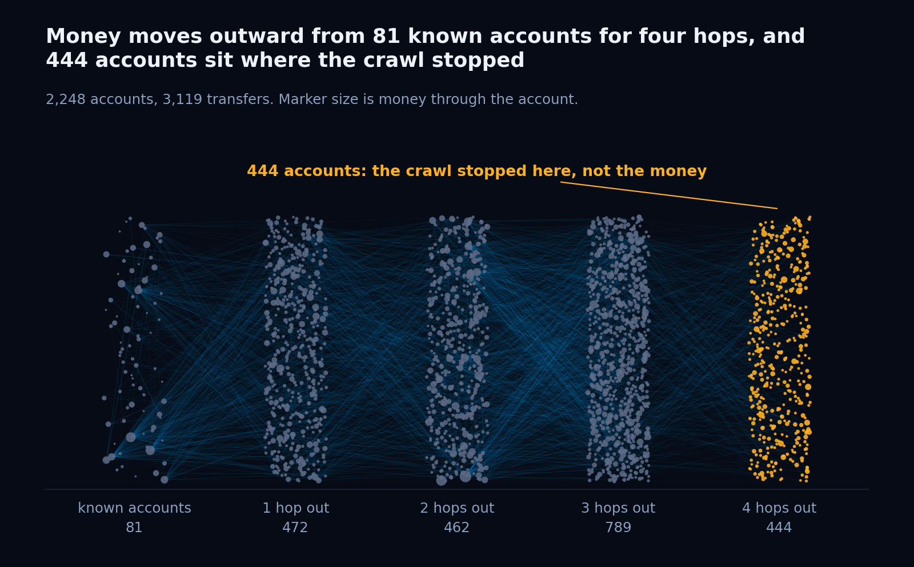

<div align="center">

# Money Graph

### Reconstructing the shape of an organised financial structure, and saying plainly where the shape runs out

**HackAlem AI 2026 · Track 02 · Freedom**

</div>

---

A crawl followed outbound transfers four hops from 81 flagged accounts through July 2026. It returned
2,248 accounts, 3,119 transfer relationships and 365,890,012 KZT of movement.

This is what that crawl can be made to say, and, equally, what it cannot.

```
pip install -r requirements.txt
python3 run.py
```

2.4 seconds. Thirteen files in `out/`. No keys, no network, no database, no build step.
All five dependencies are pinned to exact versions, because the reproducibility claim below is
byte-level and one of the pins is load-bearing.

```
python3 run.py --serve      # then open http://localhost:8000/web/
```

---

## The one paragraph that matters

Every entry in this track will hand a judge a ranked list of suspicious accounts. A ranked account is
a name, and an investigator cannot act on a name. **This ranks formations**: groups of accounts that
only make sense read together, each one carrying the single account whose removal breaks it.
**And it abstains.** 558 of the 2,248 accounts get no behavioural role, because the crawl does not
support one, and each of those rows says why in its own evidence field. A classifier that knows when
it does not know is a stronger claim than one that labels everything, and it is the honest reading of
an outbound-only crawl.


---

## Mandatory requirements, and where each one is met

| The case requires | Where it is satisfied | Evidence |
|---|---|---|
| `nodes_roles.csv`, one row per node | `out/nodes_roles.csv` | Exactly 2,248 rows, asserted in `run.py` |
| A role from the declared taxonomy | `src/moneygraph/roles.py` | Six behavioural roles, two abstentions, taxonomy extension documented in `docs/COMPLETENESS.md` |
| Numeric evidence per node | `nodes_roles.csv`, `evidence` column | Non-empty on all 2,248 rows, asserted. Longest string 161 characters, under the 200 limit |
| `clusters.csv` with a hypothesis | `out/clusters.csv` | 91 clusters, non-empty hypothesis on every row, asserted |
| `top_nodes.csv`, at least 20 rows | `out/top_nodes.csv` | 25 rows, asserted |
| Search by account id | `web/index.html` | Type or pick any gid, get its plain-language assessment, the rule and the numbers behind it, its money in and out, its hop, its group, its priority, its knowledge state, and the accounts around it on the map |
| No black-box roles | `src/moneygraph/roles.py` | Every role is a named rule with a numeric threshold. Zero model calls anywhere in the pipeline |
| No hardcoded account lists | `src/`, `web/`, `tools/` | Zero account id literals in any `.py` or `.html` file. Nothing is tuned to a specific account |
| No external enrichment | whole repo | Three parquet files in, thirteen files out. The pipeline imports no network library and makes no request |
| Runs inside 5 minutes | `run.py` | 2.4 seconds, measured, from a clean clone with a fresh virtual environment |
| Findings as hypotheses | every generated string | No output asserts wrongdoing. Wording is "the figures suggest", "worth checking as", "consistent with" |

The outputs in `out/` are committed. They regenerate byte for byte from `python3 run.py`, which is the
point: a judge can diff rather than take our word for it.

---

## Three things this found that a ranking would not

### 1. Consolidation is rarer than the shape of the data first suggests

Only **8 accounts** in the entire crawl are paid by three or more accounts each sending a dominant
share of their own outflow. The threshold that produces that number was not lowered until funnels
appeared. It is reported as it fell.

The highest in-degree account receives from 24 payers, but **21 of those send it under 40%** of what
they send in total. In-degree on its own is a poor consolidation signal in this data, and a system
that ranked on it would put that account first for the wrong reason.

**The honest caveat, which applies to us and not only to everyone else.** Observed out-degree reaches
116 and observed in-degree reaches 24, and it is tempting to call the structure fan-shaped. That
comparison is not sound. An outbound crawl enumerates every out-edge of every account it expands, but
records an in-edge only where the payer happened to be crawled. Out-degree is measured. In-degree is
censored by construction. So 8 is a **floor on consolidation, not a count of it**, and the asymmetry
between 116 and 24 is partly the shape of the crawl rather than the shape of the network. We apply
that standard to our own headline because we apply it to everyone else's two sections below.

### 2. Centrality and evidence disagree, and the disagreement is the point


Of the 15 accounts a money-weighted PageRank puts at the top, **14 fall out of the top 15** once the
rule bank is applied, most of them to `peripheral` at positions 40 to 173. Exactly one account is
agreed on by both.

This is written to `out/pagerank_vs_evidence.csv` on every run, and it is the answer to the first
question a reviewer should ask, which is why this is not simply PageRank with extra steps.

### 3. Acting on the top 20 detaches 311 further accounts


| Accounts removed | Largest component | Components | Money still followable |
|---:|---:|---:|---:|
| 0 | 1,877 | 35 | 2,248 |
| 1 | 1,863 | 37 | 2,243 |
| 5 | 1,794 | 77 | 2,165 |
| 10 | 1,726 | 115 | 2,088 |
| 20 | 1,616 | 172 | 1,917 |

The last column counts accounts the money can still be followed to from the seed set, counting the
seeds themselves. Removing the top 20 takes it from 2,248 to 1,917, a fall of 331. Twenty of those are
the removed accounts, so **311 further accounts** fall out of reach behind them. That distinction is
the difference between a real measurement and a number that flatters itself.

A ranking that does not change the network when you act on it is a ranking not worth acting on. This
one is measured, and the measurement ships as `out/resilience.csv`.

---

## Formations, not nodes


653 formations across five kinds, each with a one-sentence rule:

| Kind | Found | The rule |
|---|---:|---|
| `funnel` | 8 | A collection point, plus the payers sending it a dominant share of their outflow |
| `chain` | 51 | A directed path of relay accounts moving money onward with little retained |
| `reciprocal_loop` | 377 | A pair or short cycle returning funds to where they came from |
| `fan_out` | 45 | A distributor and the accounts it pays that have no outgoing transfer of their own |
| `bridge` | 172 | A small set whose removal splits an otherwise connected community |

An account may sit in more than one formation, and 1,421 of them do. That overlap is real and is
carried rather than suppressed.

**Every formation names its breaking point**: the member whose removal fragments it most, computed by
articulation point, by dominator analysis from the formation entry, or by flow where neither applies.
The method is reported alongside the number, in the CSV and on screen, so a figure of 3 is never
confused with a figure in tenge.

The top formation, `FUN-001`:

> The figures suggest 3 accounts sending a dominant share of their outflow into
> `100000003684369100`, 12,684,846 KZT touching the set with 4% of it staying inside, which is worth
> checking as one collection point rather than 3 unrelated payers.

Breaking point `100000003684369100`, by articulation, cutting 3 of 3 members. `docs/FORMATIONS.md`
works that row through by hand, from the raw parquet to the final score of 0.6944, so a reviewer can
recompute it without running anything.

**Fan-outs declare how much of their own shape was observed.** Across the 45 fan-outs there are 965
receiving accounts, of which **92 sit at the four-hop crawl boundary** and were never followed. Those
92 have no outgoing transfer because nothing downstream was collected, not because they retained the
money. Four fan-outs have more boundary receivers than observed ones, and each says so in its own
hypothesis rather than reporting a dispersal pattern that was mostly never looked at.

---

## What the data cannot tell you, as an output rather than a footnote

The crawl followed money **outward** from the 81 seeds. Two consequences follow, and both are
computed on every run rather than being disclaimed in prose.

**Whoever funds the seeds is invisible by construction.** Money arriving into the 81 was never
followed. Seeds moved 55,294,178 KZT out against 14,849,167 KZT observed arriving, leaving
**40,445,011 KZT, 11.05% of all turnover, with no recorded payer**. Any entry in this track that
presents a confident controller at the top of an organisational chart is presenting an artefact of
the crawl, not a finding. Stated carefully, because the data carries no balances: that figure is
money with no observed payer, not proven outside money.

**A node at hop 4 is not a terminal, it is where the crawl stopped.** 1,554 accounts are dead ends.
444 of them are truncated by the depth limit and 1,110 appear to be genuine. Treating those two groups
the same is a factual error, so the role bank keeps them apart, the interface colours them apart, and
every fan-out that contains them counts them separately.

| Knowledge state | Accounts | Share of observation |
|---|---:|---:|
| `fully_observed` | 644 | 63.98% |
| `inbound_only` | 1,091 | 18.89% |
| `outbound_only` | 50 | 9.38% |
| `truncated_at_depth` | 444 | 7.74% |
| `isolated` | 19 | 0.00% |

The share column is each state's portion of all money touched, counting a transfer once for its payer
and once for its receiver, which is how `completeness.py` computes it.

**1,604 accounts, 71.35% of the set, are not fully observed.** Every one carries a confidence score
in `out/completeness.csv` and a sentence naming the specific thing not known about it.

The honest reading of the priority list has two halves, and both are reported:

- Only **2 of the top 20** rest directly on incomplete observation. The list is robust on its own terms.
- But **15 of the top 20** send money onward into the crawl boundary, with a mean 14.4% of everything
  reachable beneath them sitting at hop 4 on an unrecorded path. The uncertainty is not in the ranking.
  It is one hop underneath it.

### The next data request, derived from figures rather than opinion

| Rank | Request | Resolves | Illuminates |
|---:|---|---:|---:|
| 1 | One more crawl hop from the 444 nodes at the depth limit | 444 accounts | 56,672,165 KZT |
| 2 | Hour-level timestamps in place of calendar dates | 327 accounts | 65,673,806 KZT |
| 3 | Inbound transfers to the 81 seeds, one hop back | 81 accounts | 40,445,011 KZT |
| 4 | Account opening dates | 36 accounts | 3,749,141 KZT |
| 5 | Counterparty bank or institution | **rejected** | no figure would change |

Request 5 is kept on the list and marked unevaluable on purpose. None of the three tables carries an
institution and nothing stands in for one, so asking for it would be an opinion about what helps
rather than a measurement. Saying so is more useful than a plausible number.

---

## The rule bank


| Role | Count | Rule | Why the cutoff sits there |
|---|---:|---|---|
| `consolidator` | 5 | in-degree >= 8, pass-through <= 0.5 | The case declares a fan-in band of 8 to 24. Observed maximum is exactly 24 |
| `transit` | 72 | 0.8 <= pass-through <= 1.2 | Reproduces the 72 pass-through accounts the case declares, exactly |
| `distributor` | 26 | out-degree >= 20 | Falls in an empty bin. Observed values run 19, 19, 19, then 21, 21, 21 |
| `coordinator` | 20 | in-degree >= 4 and out-degree >= 4 | The weakest cutoff, and labelled as such in the code. A smooth decay, not a gap |
| `terminal` | 1,091 | money in, nothing out, not at the depth limit | Genuine dead ends only. The 444 truncated ones are excluded by construction |
| `peripheral` | 476 | below every threshold above | The residual class. Includes the 19 accounts with no transfers at all, scored 0.1 |
| `abstained_boundary` | 444 | hop 4, no outgoing edge | Pass-through is zero because the crawl stopped, not because money stayed |
| `abstained_single_observation` | 114 | fewer than three transfers in total | A ratio from one pair of numbers is not a rate |

Precedence runs widest fan-in, then widest fan-out, then relay ratio, then two-sided activity, because
an account can satisfy more than one rule and the earlier rule is the stronger claim about it.

Thresholds live in a single `THRESHOLDS` dict in `src/moneygraph/roles.py`, with the observed
distribution written beside each one. The role figure above imports that dict directly, so the
documentation and the code cannot drift apart.

**Where the precedence order costs something, and we say so rather than hide it.** The transfer-count
floor sits *below* transit in the precedence order, not above it. That means **27 of the 72 transit
accounts rest on a single transfer each way**, which is the very thing the abstention rule exists to
refuse. Raising the floor above transit would drop transit to 45 and break the exact match with the 72
pass-through accounts the case itself declares. So the rule stays, the match stays, and all 27 of those
rows say in their own evidence field that the ratio is one observation rather than a rate. A judge can
find them with a single grep, which is the intention.

**On the two abstentions.** They are held apart rather than merged because the remedy differs. One more
crawl hop resolves every one of the 444 and none of the 114. Only a longer observation window reaches
the 114. A single `unclassified` bucket would hide that.

---

## The network



Accounts are laid out by hop distance from the seeds, hop 0 at the left. The rightmost column is
entirely `abstained_boundary`, which makes the edge of what was collected a visible object rather than
a caveat in a footnote.

---

## The review screen

`python3 run.py --serve`, then `http://localhost:8000/web/`

One HTML file, no framework, no build step. It loads exactly one thing, `out/graph.json`, produced by
the run beside it, and nothing else: no CDN, no web font, no external image, no analytics. It must be
served over HTTP rather than opened from disk, because a browser refuses a `fetch` from a `file://`
page, and the built-in server mounts only `/web/` and `/out/` rather than the repository root.

It opens on the answer to the case's question: which of these 2,248 accounts to look at first, and
why. The header carries a summary strip, 81 known clients, 2,248 accounts reached, 25 to review first,
653 structures found, 558 not judged, and a button, "Where the data runs out", that opens a
full-width panel.

Three panes. On the left, a search box and two tabs: "Accounts to review", the ranked list
from `top_nodes.csv` with rank, role and a one-line reason, and Structures, the formations from
`formations.csv` with kind, members, known clients and KZT through. Clicking a row selects it. In the
centre, the map. Its default mode, "Around this account", puts the selected account in the middle,
the accounts that paid it on the left, the accounts it paid on the right, one more ring either side,
arrows pointing the way the money moved, line width by KZT, nodes coloured by role, known clients
ringed. A toggle, "Whole network", lays all 2,248 out by hop, known clients on the left and hop 4 on
the right, with the selection highlighted. Selecting a structure shows its members and the edges
between them, with its breaking point marked in amber. Hovering a node shows its id and role;
clicking selects it. A legend lists the roles with counts, and hovering a role shows its plain
definition. On the right, "This account": the full gid, a sentence of the form "Received X KZT from
N accounts and sent Y KZT to M accounts", the assessed role with its plain definition, the rule's own
evidence string and confidence, the investigation priority score with its rank when the account is in
the top list, hop from a known client, group id, the knowledge state and confidence from
`completeness.csv` with its limitation sentence, the structures the account belongs to, each
clickable, and a caveat when the account sits at hop 4 with nothing going out.

The search box autocompletes on the id digits. Typing a full id or picking a suggestion selects the
account and the map re-centres on it. "Where the data runs out" holds the completeness summary
figures, the ranked next data requests with what each would resolve, the table of accounts where a
plain centrality ranking and the evidence ranking disagree, and the removal test, what happens to the
network if the top-ranked accounts are removed.

Account ids are handled as strings throughout, because an 18 digit id exceeds
`Number.MAX_SAFE_INTEGER` and two different accounts compare as equal the moment one becomes a number.

---

## How it is put together

```
data/*.parquet
      |
      v
  dataio.py        loads three tables, builds the graph from nodes.parquet rather than from the
                   edge list, because 19 seeds appear in no edge and vanish otherwise.
                   Prints an integrity report before anything else runs.
      |
      v
  features.py      degree, flow, PageRank, HITS, pass-through ratio, dwell time,
                   truncated_by_depth, genuine_terminal, isolated
      |
      v
  roles.py         the rule bank. Eight classes, numeric thresholds, evidence with figures
  clusters.py      Louvain communities, seeded, plus weakly connected components
  hypotheses.py    one plain sentence per cluster, generated from that cluster's own numbers
  flows.py         reciprocal pairs, cycles, seed chains, the resilience curve
      |
      v
  formations.py    the five formation kinds, their breaking points and their ranking
  completeness.py  knowledge state and confidence per account, and the next data request
  priority.py      the weighted ranking, weights in one dict at the top of the file
  exhibits.py      where PageRank and the rule bank disagree
      |
      v
  viewdata.py      graph.json for the review screen, every gid serialised as a string
  run.py           writes thirteen files and asserts on them before exiting
```

Python 3.11. pandas, pyarrow, networkx, numpy, scipy, all pinned exactly. Nothing else on the judged
path. `tools/figures.py` additionally needs matplotlib and is deliberately kept off that path, because
its output is committed and a judge never needs to regenerate it.

---

## Outputs

| File | Rows | What it is |
|---|---:|---|
| `nodes_roles.csv` | 2,248 | **Required.** Every account, its role, its score, its numeric evidence |
| `clusters.csv` | 91 | **Required.** Communities, with a hypothesis generated from each one's figures |
| `top_nodes.csv` | 25 | **Required.** Priority accounts, ranked, each with the arithmetic behind its rank |
| `formations.csv` | 653 | Structures, their breaking points, their ranking |
| `formation_members.csv` | 4,752 | Which accounts sit in which formation, and in what part |
| `completeness.csv` | 2,248 | What is and is not known about each account, with a confidence score |
| `next_data_request.csv` | 5 | What to ask for next, ranked, with the gain each would bring |
| `reciprocal_pairs.csv` | 177 | Accounts returning funds to each other |
| `cycles.csv` | 1,541 | Closed loops up to six hops |
| `resilience.csv` | 6 | What happens to the network as ranked accounts are removed |
| `pagerank_vs_evidence.csv` | 15 | Where centrality and the rule bank disagree |
| `graph.json` | 3,117,945 bytes | Everything the review screen reads |
| `integrity.json` | | The integrity report, machine readable |

---

## Verification

**Determinism.** Three separate processes into three separate directories, all thirteen files byte
identical by md5, and identical again to the copies committed here and to a run from a fresh virtual
environment. This is not free. `networkx.hits` draws its ARPACK starting vector from operating system
entropy, so `nodes_roles.csv` had a different hash on every run until an explicit uniform `nstart` was
passed in `features.py`. Louvain is seeded. Every set is sorted before it becomes output. Because that
fix depends on specific solver behaviour, all five dependencies are pinned to exact versions rather
than floors.

**Clean clone.** The repo copied to an empty directory excluding `__pycache__`, a fresh virtual
environment, `pip install -r requirements.txt`, then `python3 run.py`. Thirteen files, 2.3 seconds,
checksums matching.

**Assertions, in `run.py`.** Exactly 2,248 role rows. Non-empty evidence on every one. At least 20 top
nodes. A non-empty `clusters.csv` with a non-empty hypothesis on every row. Every formation has
members. Every breaking point is a real account. Completeness covers all 2,248. Confidence inside 0 to
1. A non-empty next data request. Every secondary CSV written and non-empty. `graph.json` read back,
parsed, and checked for the keys the review screen needs. The run fails loudly rather than shipping a
broken file.

**The integrity report prints before anything else**, and every figure in it is checked against the
case notes:

```
  nodes_declared                   2248
  nodes_in_graph                   2248
  edges                            3119
  transactions                     4840
  turnover_kzt                     365890012.01
  period                           ('2026-07-01', '2026-07-31')
  seeds                            81
  seeds_absent_from_edges          19
  seeds_without_outgoing           31
  dead_ends                        1554
  dead_ends_truncated_depth4       444
  dead_ends_genuine                1110
  weakly_connected_components      35
  edges_match_transactions         True
```

---

## Limitations, stated rather than discovered

| Limitation | Effect | What the pipeline does about it |
|---|---|---|
| The crawl is outbound-only | The funding source of the whole structure is outside the data | Quantified at 40,445,011 KZT and ranked third in the next data request |
| In-degree is censored, out-degree is not | Fan-in cannot be compared with fan-out | Consolidation is reported as a floor, not a count. Stated in finding 1 |
| The crawl stops at hop 4 | 444 accounts look like terminals and are not | Their own class, `abstained_boundary`, excluded from `terminal`, counted separately inside fan-outs |
| Dates, not timestamps | Same-day ordering is unresolved on 327 accounts | Ranked second in the next data request, with the turnover it would resolve |
| No balances | Seed funding is a residual, not a measurement | Labelled as "no observed payer", never as "outside money" |
| No institution field | Nothing can be said about banks | Request 5, rejected on the evidence, kept visible |
| 28 transit accounts show negative dwell | Outflow observed before inflow | An artefact of the crawl. Dwell is reported, never used as a threshold |
| 27 transit roles rest on one transfer each way | A ratio from a single pair is not a rate | Kept, to preserve the declared count of 72, and said so in each of the 27 evidence strings |
| Coordinator cutoff at 4 and 4 | Sits on a smooth curve, not a natural break | Said so in the code comment rather than dressed up as measured |
| No automated test suite | Correctness rests on the run assertions and the integrity report | Both fail the run loudly. The worked example in `docs/FORMATIONS.md` is checkable by hand |

---

## Scaling

The pipeline is linear or near-linear in edges almost everywhere, and runs 2,248 accounts in 2.4
seconds. Three things would need attention at a million nodes, and they are known rather than guessed:

- **Cycle enumeration** currently runs to six hops and returns 1,541 cycles here, 1,073 of them at
  length six. That growth is the problem: the bound is a parameter in `flows.py` and would come down
  before the graph does up.
- **Maximal path enumeration inside a chain component** is factorial in component size and is capped at
  12 in the rules dict. The largest chain component in this data is 5, so nothing is currently skipped.
- **Louvain and HITS** both go out of core past roughly a million edges and would move to a graph store.

The rule bank itself does not change with scale. It reads one row at a time.

---

## Data handling

The dataset is anonymised and provided for this competition. Account identifiers are opaque. Nothing
in this repository enriches them from any outside source, and nothing leaves the machine it runs on.

Every finding here is a hypothesis for an analyst to test, generated from transfer patterns. Transfer
patterns are not proof of anything, and no output of this system asserts that they are.

---

<div align="center">

**Sam Yarasani and Karina Shalia**

</div>
